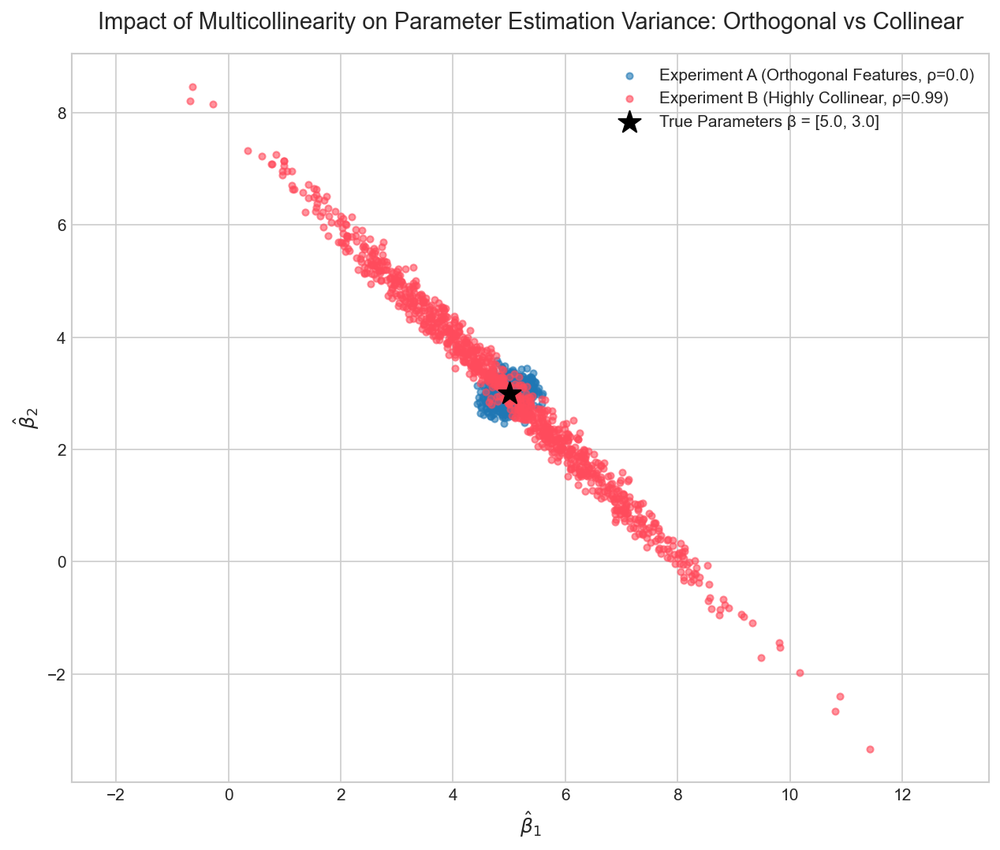

# Week 05 Report: Covariance & Multicollinearity

## 1. 实验结果说明

本次实验通过Monte Carlo模拟，比较了两个特征矩阵设计下线性回归系数估计值的差异：

- **实验 A：正交特征**，设定 \(\rho = 0.0\)。
- **实验 B：高度共线特征**，设定 \(\rho = 0.99\)。

真实参数设定为：\(\beta = [5.0, 3.0]^T\)。噪音标准差设定为 \(\sigma = 2.0\)。

## 2. 对比散点图

下面是两组实验的估计点对比图：



图中：
- 蓝色点表示实验 A 的 \(\hat{\beta}_1\) 与 \(\hat{\beta}_2\) 估计点。
- 红色点表示实验 B 的 \(\hat{\beta}_1\) 与 \(\hat{\beta}_2\) 估计点。
- 黑色星号为真实参数点 \(\beta = [5.0, 3.0]\)。

## 3. 终端打印的两个协方差矩阵

### 实验 A：正交特征（\(\rho = 0.0\)）

理论协方差矩阵：

```
[[0.0388 0.0029]
 [0.0029 0.0298]]
```

经验协方差矩阵：

```
[[0.0383 0.0036]
 [0.0036 0.029 ]] 
```

### 实验 B：高度共线特征（\(\rho = 0.99\)）

理论协方差矩阵：

```
[[ 3.317  -3.225 ]
 [-3.225   3.1726]]
```

经验协方差矩阵：

```
[[ 3.1818 -3.0933]
 [-3.0933  3.0455]]
```

## 4. 思考题：从散点图的形状来看，当 X1和 X2高度正相关 (ρ=0.99) 时，为什么算出来的 β^1和 β^2之间会呈现强烈的负相关？（提示：思考总体预算的分配）

当 \(X_1\) 和 \(X_2\) 高度正相关 \(\rho = 0.99\) 时，散点图显示 \(\hat{\beta}_1\) 与 \(\hat{\beta}_2\) 的估计结果沿一条斜线分布，并呈现强烈的负相关。

因为两列特征几乎是在同一条方向上提供解释信息，回归模型不能准确区分它们各自对 \(y\) 的贡献。模型必须在这两个系数之间分配相同的总体拟合预算：如果某一次模拟中 \(\hat{\beta}_1\) 偏大，那么为了保持整体预测不变，\(\hat{\beta}_2\) 就必须偏小；反之亦然。

这种“预算分配”现象导致系数估计之间出现负相关，因此散点图呈现一条从左上到右下的倾斜带状结构。这正是多重共线性使得参数估计变得不稳定、但仍保持总体拟合效果的直观表现。
